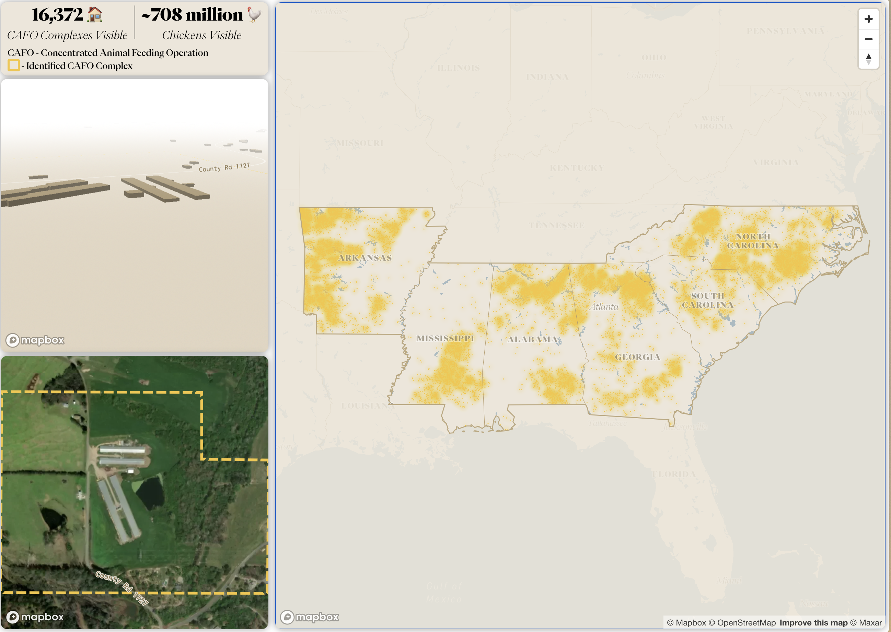

# CAFO Explorer
This Repo contains the code for the CAFO Explorer, a web application that allows users to explore the locations of Concentrated Animal Feeding Operations (CAFOs) in the United States. The application is a part of [The Plotline](https://theplotline.org/), a project by Earth Genome focused at the intersection of Food and Climate.

The data for this application was generated using [Earth Index](https://www.earthgenome.org/earth-index), an AI tool that uses satellite imagery to identify objects and trends in satellite imagery. The data was then processed and visualized using Python Notebooks and built into an interactive web application that can be accessed at [CAFO Explorer](https://stories.theplotline.org/cafo-explorer/).

<!-- add a photo below -->
